#  <br/> Basic controls


Pip.WebUI.Controls modules provides additional controls, that are "missing" in angular-material library.

**Color picker** control allows to select a color from predefined pallette.

<a href="doc/images/img-color-picker.png" style="border: 3px ridge #c8d2df; display: inline-block">
    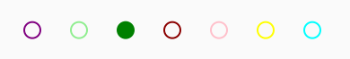
</a>

See online sample [here...](http://webui.pipdevs.com/pip-webui-controls/index.html#/color_picker)

**Date** control allows to set a date using 3 comboboxes for day, month and year.

<a href="doc/images/img-date.png" style="border: 3px ridge #c8d2df; display: inline-block">
    
</a>

**Date range** control allows to pick a specific date range on daily, weekly, monthly or yearly time interval. 
This control can be helpful in various calendars and planning tools.

<a href="doc/images/img-date-range.png" style="border: 3px ridge #c8d2df; display: inline-block">
    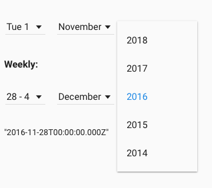
</a>

See online sample [here...](http://webui.pipdevs.com/pip-webui-controls/index.html#/date)

**Time range** control visualizes specific time interval

<a href="doc/images/img-time-range.png" style="border: 3px ridge #c8d2df; display: inline-block">
    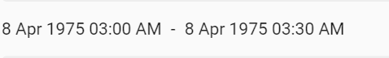
</a>

See online sample [here...](http://webui.pipdevs.com/pip-webui-controls/index.html#/tags)

**Time range** control allows to specify time interval rounded to days or half-hour chunks

<a href="doc/images/img-time-range-edit.png" style="border: 3px ridge #c8d2df; display: inline-block">
    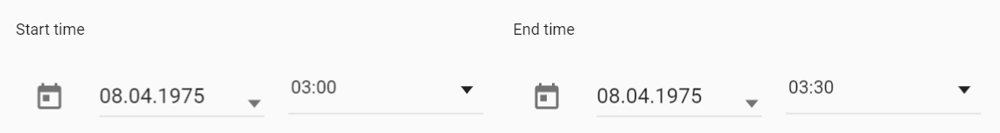
</a>

See online sample [here...](http://webui.pipdevs.com/pip-webui-controls/index.html#/tags)

**Image slider** creates an interactive image carusel with smooth animations. This control is usually used on landing or guidance screens.

<a href="doc/images/img-slider.png" style="border: 3px ridge #c8d2df; display: inline-block">
    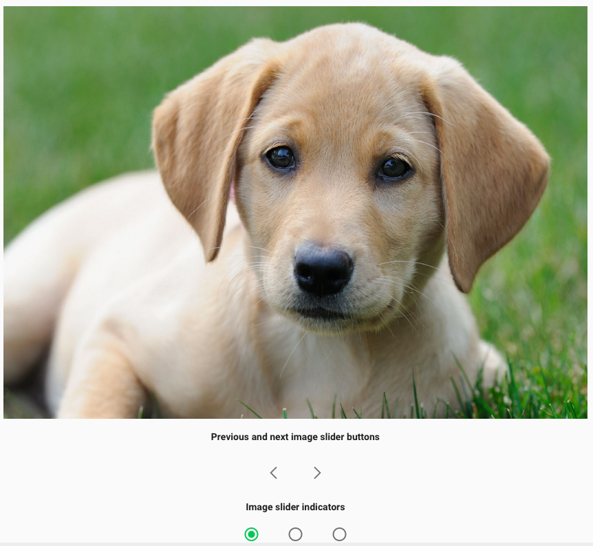
</a>

See online sample [here...](http://webui.pipdevs.com/pip-webui-controls/index.html#/image_slider)

**Markdown** control visualizes hypertext formated as markdown and converted int HTML.

<a href="doc/images/img-markdown.png" style="border: 3px ridge #c8d2df; display: inline-block">
    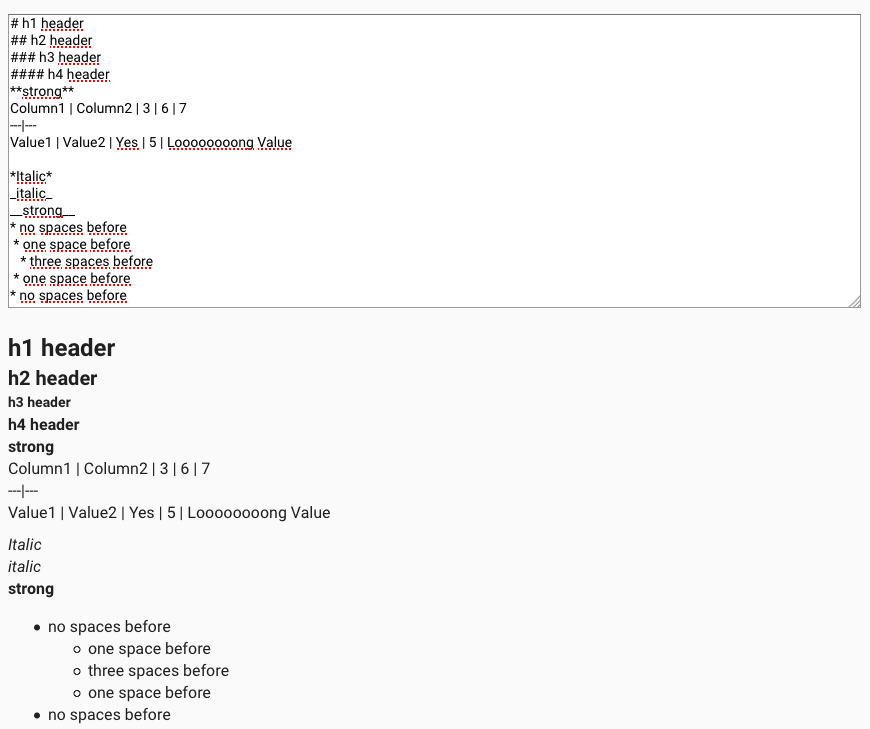
</a>

See online sample [here...](http://webui.pipdevs.com/pip-webui-controls/index.html#/markdown)

**Popover** control provides nice looking popovers with achors. Usually that control is used for context guidance.

<a href="doc/images/img-popover.png" style="border: 3px ridge #c8d2df; display: inline-block">
    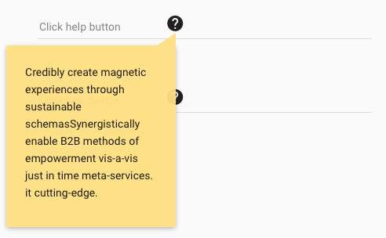
</a>

See online sample [here...](http://webui.pipdevs.com/pip-webui-controls/index.html#/popover)

**Progress** control shows animated ring with a logo inside. It is used in page transitions and initial application loading.

<a href="doc/images/img-progress.png" style="border: 3px ridge #c8d2df; display: inline-block">
    
</a>

See online samples [here...](http://webui.pipdevs.com/pip-webui-controls/index.html#/progress)

**Refresh button** shows at the top of the screen when new data is available. By clicking on it, user triggers the update. It is used as a visual confirmation of he data arrival and helps to manager user expectations.

<a href="doc/images/img-btn-refresh.png" style="border: 3px ridge #c8d2df; display: inline-block">
    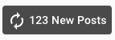
</a>

See online samples [here...](http://webui.pipdevs.com/pip-webui-controls/index.html#/refresh)

**Tags** control visializes a list of read-only chips (tags)

<a href="doc/images/img-tags.png" style="border: 3px ridge #c8d2df; display: inline-block">
    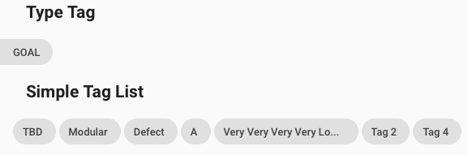
</a>

See online samples [here...](http://webui.pipdevs.com/pip-webui-controls/index.html#/tags)

**Toast** services allows to show toast messages, formatted in different ways and presented in priority order. It ensures that one toast message will not hide another one, until timeout expires or users handles it.

<a href="doc/images/img-toast.png" style="border: 3px ridge #c8d2df; display: inline-block">
    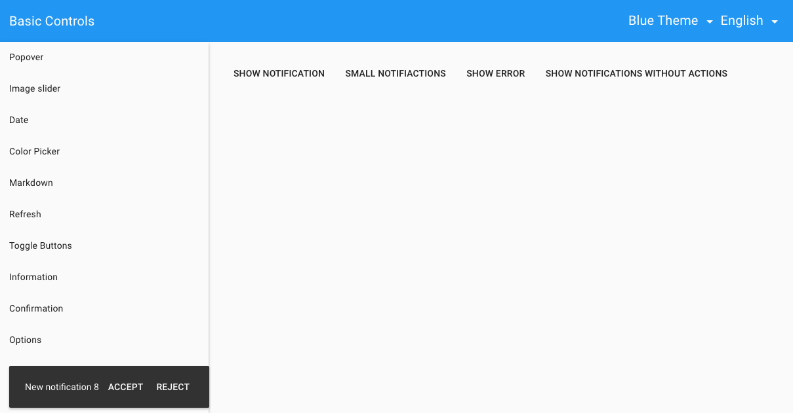
</a>

See online samples [here...](http://webui.pipdevs.com/pip-webui-controls/index.html#/toasts)

**Toggle buttons** control implement multiple radio buttons. Only one of them can be pressed at any time. On phones buttons are replaced with dropdown list.

<a href="doc/images/img-toggle-btns.png" style="border: 3px ridge #c8d2df; display: inline-block">
    
</a>

See online samples [here...](http://webui.pipdevs.com/pip-webui-controls/index.html#/toggle_buttons)

**Standard dialogs** simplify developer task to show various messages. It includes:
- Information message dialog
- Confirmation message dialog
- Error message dialog
- Option selection dialog

<a href="doc/images/img-info-dialog.png" style="border: 3px ridge #c8d2df; display: inline-block">
    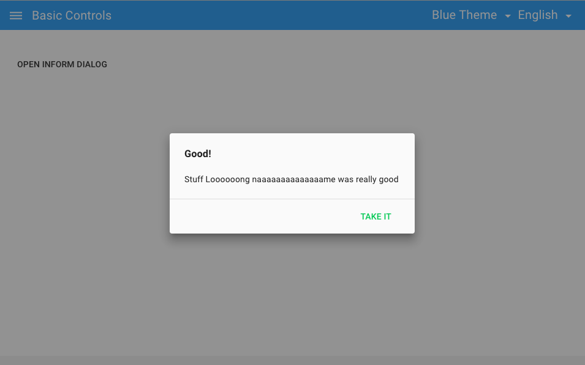
</a>

Standard dialogs require only few lines of code from developers:
```javascript
 pipInformationDialog.show(
        {
            event: event,
            title: 'Good!',
            message: 'Stuff %s was really good',
            item: 'Loooooong naaaaaaaaaaaaaame',
            ok: 'Take It'
        },
        function () {
            console.log('Taken');
        }
    );
```

See online samples [here...](http://webui.pipdevs.com/pip-webui-controls/index.html#/color_picker)


## Learn more about the module

- [User's guide](doc/UsersGuide.md)
- [Online samples](http://webui.pipdevs.com/pip-webui-controls/index.html)
- [API reference](http://webui-api.pipdevs.com/pip-webui-controls/index.html)
- [Developer's guide](doc/DevelopersGuide.md)
- [Changelog](CHANGELOG.md)
- [Pip.WebUI project website](http://www.pipwebui.org)
- [Pip.WebUI project wiki](https://github.com/pip-webui/pip-webui/wiki)
- [Pip.WebUI discussion forum](https://groups.google.com/forum/#!forum/pip-webui)
- [Pip.WebUI team blog](https://pip-webui.blogspot.com/)

## <a name="dependencies"></a>Module dependencies

* [pip-webui-lib](https://github.com/pip-webui/pip-webui-lib): angular, angular material and other 3rd party libraries
* [pip-webui-css](https://github.com/pip-webui/pip-webui-css): CSS styles and web components
* [pip-webui-core](https://github.com/pip-webui/pip-webui-core): localization and other core services

## <a name="license"></a>License

This module is released under [MIT license](License) and totally free for commercial and non-commercial use.
