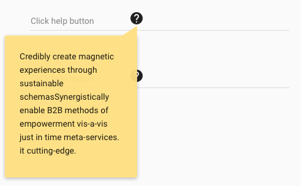

# Pip.WebUI.Controls User's Guide

## <a name="contents"></a> Contents
- [Installing](#install)
- [pip-color-picker directive](#color_picker)
- [pip-image-slider directive](#image_slider)
- [pip-markdown directive](#markdown)
- [pip-popover directive](#popover)
- [pip-routing-progress directive](#routing_progress)
- [pip-ref-expander component](#ref_expander)
- [pip-empty component](#empty)
- [pipToasts service](#toasts)
- [Questions and bugs](#issues)


## <a name="install"></a> Installing

Add dependency to **pip-webui** into your **bower.json** or **package.json** file depending what you use.
```javascript
"dependencies": {
  ...
  "pip-webui": "*"
  ...
}
```

Alternatively you can install **pip-webui** manually using **bower**:
```bash
bower install pip-webui
```

or install it using **npm**:
```bash
npm install pip-webui
```

Include **pip-webui** files into your web application.
```html
<link rel="stylesheet" href=".../pip-webui-lib.min.css"/>
<link rel="stylesheet" href=".../pip-webui.min.css"/>
...
<script src=".../pip-webui-lib.min.js"></script>
<script src=".../pip-webui.min.js"></script>
```

Register **pipControls** module in angular module dependencies.
```javascript
angular.module('myApp',[..., 'pipControls']);
```

## <a name="color_picker"></a> pip-color-picker directive

**pip-color-picker** directive allows to select a color from predefined pallette.

### Usage
```html
<pip-color-picker ng-model="color" ng-disabled="disabled" pip-colors="colors">
</pip-color-picker>
```


See online sample [here...](http://webui.pipdevs.com/pip-webui-controls/index.html#/color_picker)

### Attributes
* **pip-colors** - colors array

## <a name="image_slider"></a> pip-image-slider directive

**pip-image-slider** directive creates an interactive image carusel with smooth animations. It is usually used on landing or guidance screens.

### Usage
```html
<div pip-image-slider pip-animation-type="'fading'" class="w-stretch" pip-animation-interval="5000">
     <div class="pip-animation-block w-stretch" ng-repeat="image in images">
         
     </div>
</div>
```


See online sample [here...](http://webui.pipdevs.com/pip-webui-controls/index.html#/image_slider)

### Attributes
* **pip-animation-type** - type of animation (carousel, fading)
* **pip-animation-interval** - interval animation in ms. By default equal 4500 ms

## <a name="markdown"></a> pip-markdown directive

**pip-markdown** directive visualizes hypertext formated as markdown and converted int HTML.

### Usage
```html
<pip-markdown pip-text="text" pip-rebind="true" pip-line-count="5"></pip-markdown>
```


See online sample [here...](http://webui.pipdevs.com/pip-webui-controls/index.html#/markdown)

### Attributes
* **pip-text** - text object
* **pip-line-count** - max number of lines for a display
* **pip-rebind** - binding field pip-text. By default equal false

## <a name="popover"></a> pip-popover directive

**pip-popover** directive provides nice looking popovers with achors. Usually that control is used for context guidance.

### Usage
```javascript 
pipPopover.show({
   class: 'pip-tip',
   locals: {
       title: $scope.title,
       content: $scope.content
   },
   cancelCallback: function () {
       console.log('backdrop clicked');
   },
   controller: 'customController',
   template: 'custom.html'
});
```



See online sample [here...](http://webui.pipdevs.com/pip-webui-controls/index.html#/popover)

### Methods
* **show** - open popover

## <a name="routing_progress"></a> pip-routing-progress directive

**pip-routing-progress** directive shows animated ring with a logo inside. It is used in page transitions and initial application loading.

### Usage
```html
<pip-routing-progress></pip-routing-progress>
```


See online samples [here...](http://webui.pipdevs.com/pip-webui-controls/index.html#/progress)


## <a name="ref_expander"></a> pip-ref-expander component

**pip-ref-expander** is a clickable elemement that looks similar to **pip-ref-item** but also allows to expand/collapse details.

### Usage
```html
<div class="pip-ref-expander layout-row layout-align-start-center">
    <md-button class="flex">
        <div class="layout-row layout-align-start-center">
            
            <div class="pip-content flex">
                <p class="pip-title">
                    <md-icon md-svg-icon="icons:forward-all"></md-icon>
                    {{item.name}}
                </p>
                <p class="pip-subtitle">
                    <md-icon md-svg-icon="icons:world"></md-icon>
                    <span>{{item.status1}}</span>
                </p>
            </div>
            <md-icon md-svg-icon="icons:triangle-down" class="pip-chevron"></md-icon>
        </div>
    </md-button>
</div>
```


### CSS Classes
* **pip-pic-sm** - class for small picture
* **pip-pic** - class for pictures
* **pip-content** - class for general div 
* **pip-title** - class for title text
* **pip-subtitle** - class for subtitle text

## <a name="empty"></a> pip-empty component

**pip-empty** component shows a placeholder for pages without data. It gives an explanation and provides one or few actions to get started.

### Usage
```html
<div class="pip-empty" >
        <div style="background-image: url('images/ES_Timeline.svg');" class="pip-pic" ></div>

        <div class="pip-text">
            Here you can plan the main events of the day and coordinate with your partners
        </div>
        <div class="pip-actions">
            <md-button class="md-accent">
                ADD EVENT
            </md-button>
            <md-button class="md-accent">
                ADD EVENT FROM CURRENT WEEK
            </md-button>
            <md-button class="md-accent">
                WORK ON GOALS
            </md-button>
        </div>

    </div>
```


### CSS Classes
* **pip-empty** - general class for pip-empty component
* **pip-text** - class for text 
* **pip-pic** - class for picture
* **pip-actions** - class for div with buttons


## <a name="toasts_service"></a> pipToasts service

**pipToast** services allows to show toast messages, formatted in different ways and presented in priority order. It ensures that one toast message will not hide another one, until timeout expires or users handles it.

### Usage
```javascript
thisModule.controller('ToastsController',
  function (pipToasts) {
  
     pipToasts.showNotification('Do you want accept goal?', ['accept', 'reject']);
     ...
     var error = {
           path: '/api/1.0/parties/:id/followers',
           method: 'POST',
           code: 400,
           name: 'Bad Request',
           error: 1402,
           message: 'Missing party information'
     };
     pipToasts.showError(error.message, null, null, null, error);
 });
```


See online samples [here...](http://webui.pipdevs.com/pip-webui-controls/index.html#/toasts)

### Methods
* **showNotification** - show toast with notification message and actions
* **showMessage** - show toast with notification message 
* **showError** - show toast with error message
* **hideAllToasts** - hide all toasts in queue
* **clearToasts** - delete all toasts in queue
* **removeToastsById** - delete toast in queue when id toast equal id in params
* **getToastById** - return data toast by id

## <a name="issues"></a> Questions and bugs

If you have any questions regarding the module, you can ask them using our 
[discussion forum](https://groups.google.com/forum/#!forum/pip-webui).

Bugs related to this module can be reported using [github issues](https://github.com/pip-webui/pip-webui-controls/issues).
