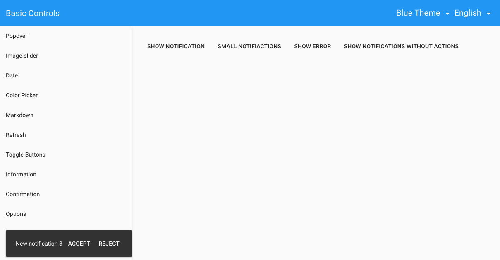

# Pip.WebUI.Controls User's Guide

## <a name="contents"></a> Contents
- [Installing](#install)
- [pip-color-picker directive](#color_picker)
- [pip-date directive](#date)
- [pip-time-range directive](#time_range)
- [pip-time-range-edit directive](#time_range_edit)
- [pip-image-slider directive](#image_slider)
- [pip-markdown directive](#markdown)
- [pip-popover directive](#popover)
- [pip-routing-progress directive](#routing_progress)
- [pip-refresh-button directive](#refresh_button)
- [pip-tag-list directive](#tag_list)
- [pip-toggle-buttons directive](#toggle_buttons)
- [pipToasts service](#toasts)
- [pipInformationDialog](#information_dialog)
- [pipConfirmationDialog](#confirmation_dialog)
- [pipErrorDialog](#error_dialog)
- [pipOptionsDialog](#error_dialog)
- [Questions and bugs](#issues)


## <a name="install"></a> Installing

Add dependency to **pip-webui** into your **bower.json** or **package.json** file depending what you use.
```javascript
"dependencies": {
  ...
  "pip-webui": "*"
  ...
}
```

Alternatively you can install **pip-webui** manually using **bower**:
```bash
bower install pip-webui
```

or install it using **npm**:
```bash
npm install pip-webui
```

Include **pip-webui** files into your web application.
```html
<link rel="stylesheet" href=".../pip-webui-lib.min.css"/>
<link rel="stylesheet" href=".../pip-webui.min.css"/>
...
<script src=".../pip-webui-lib.min.js"></script>
<script src=".../pip-webui.min.js"></script>
```

Register **pipControls** module in angular module dependencies.
```javascript
angular.module('myApp',[..., 'pipControls']);
```

## <a name="color_picker"></a> pip-color-picker directive

**pip-color-picker** directive allows to select a color from predefined pallette.

### Usage
```html
<pip-color-picker ng-model="color" ng-disabled="disabled" pip-colors="colors">
</pip-color-picker>
```


See online sample [here...](http://webui.pipdevs.com/pip-webui-controls/index.html#/color_picker)

### Attributes
Todo: Document all directive attributes


## <a name="date"></a> pip-date directive

**pip-date** directive allows to set a date using 3 comboboxes for day, month and year.

### Usage
```html
```
Todo: Add HTML snipper to demonstrate the directive with all attributes

Todo: Add screenshot for pip-date control here

### Attributes
Todo: Document all directive attributes


## <a name="date_range"></a> pip-date-range directive

**pip-date-range** directive allows to pick a specific date range on daily, weekly, monthly or yearly time interval. 
This control can be helpful in various calendars and planning tools.

### Usage
```html
```
Todo: Add HTML snipper to demonstrate the directive with all attributes


See online sample [here...](http://webui.pipdevs.com/pip-webui-controls/index.html#/date)

### Attributes
Todo: Document all directive attributes


## <a name="time_range"></a> pip-time-range directive

**pip-time-range** directive visualizes specific time interval

### Usage
```html
```
Todo: Add HTML snipper to demonstrate the directive with all attributes


See online sample [here...](http://webui.pipdevs.com/pip-webui-controls/index.html#/tags)

### Attributes
Todo: Document all directive attributes


## <a name="time_range_edit"></a> pip-time-range-edit directive

**pip-time-range-edit** directive allows to specify time interval rounded to days or half-hour chunks

### Usage
```html
```
Todo: Add HTML snipper to demonstrate the directive with all attributes


See online sample [here...](http://webui.pipdevs.com/pip-webui-controls/index.html#/tags)

### Attributes
Todo: Document all directive attributes


## <a name="image_slider"></a> pip-image-slider directive

**pip-image-slider** directive creates an interactive image carusel with smooth animations. It is usually used on landing or guidance screens.

### Usage
```html
```
Todo: Add HTML snipper to demonstrate the directive with all attributes


See online sample [here...](http://webui.pipdevs.com/pip-webui-controls/index.html#/image_slider)

### Attributes
Todo: Document all directive attributes


## <a name="markdown"></a> pip-markdown directive

**pip-markdown** directive visualizes hypertext formated as markdown and converted int HTML.

### Usage
```html
```
Todo: Add HTML snipper to demonstrate the directive with all attributes


See online sample [here...](http://webui.pipdevs.com/pip-webui-controls/index.html#/markdown)

### Attributes
Todo: Document all directive attributes


## <a name="popover"></a> pip-popover directive

**pip-popover** directive provides nice looking popovers with achors. Usually that control is used for context guidance.

### Usage
```html
```
Todo: Add HTML snipper to demonstrate the directive with all attributes


See online sample [here...](http://webui.pipdevs.com/pip-webui-controls/index.html#/popover)

### Attributes
Todo: Document all directive attributes


## <a name="routing_progress"></a> pip-routing-progress directive

**pip-routing-progress** directive shows animated ring with a logo inside. It is used in page transitions and initial application loading.

### Usage
```html
```
Todo: Add HTML snipper to demonstrate the directive with all attributes


See online samples [here...](http://webui.pipdevs.com/pip-webui-controls/index.html#/progress)

### Attributes
Todo: Document all directive attributes


## <a name="refresh_button"></a> pip-refresh-button directive

**pip-refresh-button** shows at the top of the screen when new data is available. By clicking on it, user triggers the update. It is used as a visual confirmation of he data arrival and helps to manager user expectations.

### Usage
```html
```
Todo: Add HTML snipper to demonstrate the directive with all attributes


See online samples [here...](http://webui.pipdevs.com/pip-webui-controls/index.html#/refresh)

### Attributes
Todo: Document all directive attributes


## <a name="tag_list"></a> pip-tag-list directive

**pip-tag-list** directive visializes a list of read-only chips (tags)

### Usage
```html
```
Todo: Add HTML snipper to demonstrate the directive with all attributes


See online samples [here...](http://webui.pipdevs.com/pip-webui-controls/index.html#/tags)

### Attributes
Todo: Document all directive attributes


## <a name="toggle_buttons"></a> pip-toggle-buttons directive

**pip-toggle-buttons** directive implement multiple radio buttons. Only one of them can be pressed at any time. On phones buttons are replaced with dropdown list.

### Usage
```html
```
Todo: Add HTML snipper to demonstrate the directive with all attributes


See online samples [here...](http://webui.pipdevs.com/pip-webui-controls/index.html#/toggle_buttons)

### Attributes
Todo: Document all directive attributes


## <a name="toasts_service"></a> pipToasts service

**pipToast** services allows to show toast messages, formatted in different ways and presented in priority order. It ensures that one toast message will not hide another one, until timeout expires or users handles it.

### Usage
Todo: Add code snippet to demonstrate use of pipToasts service



See online samples [here...](http://webui.pipdevs.com/pip-webui-controls/index.html#/toasts)

### Methods
Todo: Describe methods of pipToasts service 


## <a name="information_dialog"></a> pipInformationDialog

**pipInformationDialog** show dialog with information message and OK button.

### Usage
```javascript
 pipInformationDialog.show(
        {
            event: event,
            title: 'Good!',
            message: 'Stuff %s was really good',
            item: 'Loooooong naaaaaaaaaaaaaame',
            ok: 'Take It'
        },
        function () {
            console.log('Taken');
        }
    );
```


### Methods
Todo: Describe here dialog methods


## <a name="confirmation_dialog"></a> pipConfirmationDialog

**pipConfirmationDialog** shows message with question and YES and NO buttons.

### Usage
Todo: Add code snippet to demonstrate call of the dialog

Todo: Add screenshot with the dialog

### Methods
Todo: Describe here dialog methods


## <a name="error_dialog"></a> pipErrorDialog

**pipErrorDialog** shows error message with collapsible details.

### Usage
Todo: Add code snippet to demonstrate call of the dialog

Todo: Add screenshot with the dialog

### Methods
Todo: Describe here dialog methods


## <a name="options_dialog"></a> pipOptionsDialog

**pipOptionsDialog** allows to pick one from several available options.

### Usage
Todo: Add code snippet to demonstrate call of the dialog

Todo: Add screenshot with the dialog

### Methods
Todo: Describe here dialog methods


## <a name="issues"></a> Questions and bugs

If you have any questions regarding the module, you can ask them using our 
[discussion forum](https://groups.google.com/forum/#!forum/pip-webui).

Bugs related to this module can be reported using [github issues](https://github.com/pip-webui/pip-webui-controls/issues).
